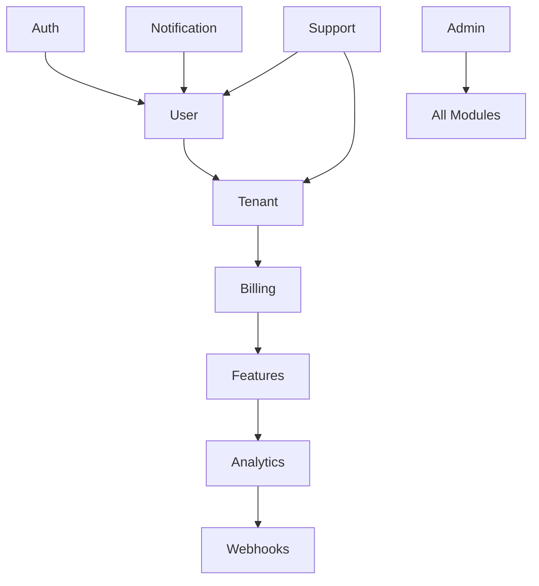

# Module Integration Guide

This guide explains how to integrate and use the modules in the Modern Backend Template.

## Module Overview

The template includes 12 feature-rich modules:

1. **Auth Module** - Authentication, JWT, OAuth, 2FA
2. **User Module** - User profiles, preferences, sessions
3. **Tenant Module** - Multi-tenancy, teams, invitations
4. **Billing Module** - Subscriptions, payments (Stripe)
5. **Features Module** - Feature flags, entitlements
6. **Notification Module** - Multi-channel notifications
7. **Analytics Module** - Event tracking, reporting
8. **Webhooks Module** - Real-time event notifications
9. **Onboarding Module** - User onboarding flows
10. **Support Module** - Ticket system, knowledge base
11. **API Usage Module** - Rate limiting, usage tracking
12. **Admin Module** - Admin dashboard, system management

## Module Dependencies



## Quick Start

### 1. Environment Setup

First, ensure all required environment variables are set. Copy `.env.example` to `.env` and configure:

```bash
cp .env.example .env
```

Key configurations per module:

#### Auth Module
```env
JWT_ACCESS_SECRET=your-secret-key
JWT_REFRESH_SECRET=your-refresh-secret
GOOGLE_CLIENT_ID=your-google-client-id
GOOGLE_CLIENT_SECRET=your-google-client-secret
```

#### Billing Module
```env
STRIPE_SECRET_KEY=sk_test_...
STRIPE_WEBHOOK_SECRET=whsec_...
```

#### Support Module
```env
SUPPORT_EMAIL=support@example.com
SLA_FIRST_RESPONSE_HIGH=120
```

### 2. Database Setup

Run migrations to create all required tables:

```bash
# Generate Prisma client
pnpm db:generate

# Run migrations
pnpm db:migrate

# Seed initial data
pnpm db:seed
```

### 3. Module Initialization

Modules are automatically initialized in the correct order when the application starts. The initialization order respects dependencies:

```typescript
// src/app.ts
const MODULE_INIT_ORDER = [
  { name: 'Auth', init: initializeAuthModule },
  { name: 'User', init: initializeUserModule },
  { name: 'Tenant', init: initializeTenantModule },
  { name: 'Billing', init: initializeBillingModule },
  // ... etc
];
```

## Using Modules

### Authentication Flow

```typescript
// 1. Register user
POST /api/auth/register
{
  "email": "user@example.com",
  "password": "SecurePass123!",
  "firstName": "John",
  "lastName": "Doe"
}

// 2. Login
POST /api/auth/login
{
  "email": "user@example.com",
  "password": "SecurePass123!"
}

// 3. Use access token in headers
Authorization: Bearer <access_token>
```

### Multi-Tenancy

```typescript
// 1. Create tenant
POST /api/tenants
{
  "name": "Acme Corp",
  "slug": "acme-corp"
}

// 2. Invite team members
POST /api/tenants/:tenantId/members/invite
{
  "email": "teammate@example.com",
  "role": "MEMBER"
}

// 3. Access tenant-scoped resources
GET /api/projects
Headers: { "X-Tenant-Id": "tenant-123" }
```

### Billing Integration

```typescript
// 1. Create checkout session
POST /api/billing/checkout
{
  "priceId": "price_pro"
}

// 2. Handle webhook events
// Configure webhook URL in Stripe Dashboard:
// https://api.yourdomain.com/api/billing/webhook

// 3. Check feature access
const hasAccess = await checkFeature(userId, 'advanced_analytics');
```

### Support Tickets

```typescript
// 1. Create ticket
POST /api/tickets
{
  "subject": "Need help with billing",
  "description": "I can't update my payment method",
  "type": "BILLING_ISSUE"
}

// 2. Add message
POST /api/tickets/:ticketId/messages
{
  "content": "Here's more information..."
}
```

## Module Configuration

### Enabling/Disabling Modules

You can selectively enable/disable modules based on your needs:

```typescript
// config/modules.config.ts
export const ENABLED_MODULES = {
  auth: true,
  user: true,
  tenant: true,
  billing: process.env.ENABLE_BILLING === 'true',
  support: process.env.ENABLE_SUPPORT === 'true',
  // ... etc
};
```

### Custom Module Configuration

Each module can be configured via environment variables or programmatically:

```typescript
// Example: Configure support module
const supportConfig = {
  autoCloseDays: 7,
  slaConfig: {
    firstResponse: {
      critical: 30,
      high: 120
    }
  }
};
```

## Common Patterns

### 1. Module Service Access

```typescript
import { Container } from 'typedi';
import { UserService } from '@modules/user/user.service';

// Get service instance
const userService = Container.get(UserService);
const user = await userService.findById(userId);
```

### 2. Event-Driven Communication

```typescript
import { eventBus } from '@shared/events/event-bus';

// Listen to events
eventBus.on('user.created', async (payload) => {
  // Send welcome email
  // Create onboarding flow
  // Track analytics
});

// Emit events
eventBus.emit('ticket.created', {
  ticketId: ticket.id,
  userId: user.id
});
```

### 3. Feature Flags

```typescript
import { isFeatureFlagEnabled } from '@modules/features';

// Check feature flag
if (await isFeatureFlagEnabled('new_dashboard', userId)) {
  // Show new dashboard
}
```

### 4. Rate Limiting

```typescript
// Applied automatically via middleware
// Configure per-endpoint limits:
app.post('/api/expensive-operation', {
  preHandler: [endpointRateLimit('/api/expensive-operation', 5, 60000)]
}, handler);
```

## Testing Modules

### Unit Tests

```typescript
// Example: Testing user service
describe('UserService', () => {
  it('should create user', async () => {
    const user = await userService.create({
      email: 'test@example.com',
      password: 'Test123!'
    });
    expect(user.email).toBe('test@example.com');
  });
});
```

### Integration Tests

```typescript
// Example: Testing API endpoints
describe('POST /api/auth/register', () => {
  it('should register new user', async () => {
    const response = await request(app)
      .post('/api/auth/register')
      .send({
        email: 'test@example.com',
        password: 'Test123!'
      });

    expect(response.status).toBe(201);
    expect(response.body.data.user.email).toBe('test@example.com');
  });
});
```

## Production Deployment

### 1. Environment Variables

Ensure all production environment variables are set:

```env
NODE_ENV=production
DATABASE_URL=postgresql://...
REDIS_URL=redis://...
SENTRY_DSN=https://...
```

### 2. Database Migrations

```bash
# Run production migrations
pnpm db:migrate:prod
```

### 3. Health Checks

All modules contribute to health checks:

```bash
GET /health

{
  "status": "healthy",
  "modules": {
    "auth": "healthy",
    "database": "healthy",
    "redis": "healthy",
    "elasticsearch": "healthy"
  }
}
```

### 4. Monitoring

Monitor module-specific metrics:

- Auth: Login success/failure rates
- Billing: Payment success rates, MRR
- Support: Ticket response times, SLA compliance
- API Usage: Rate limit hits, quota usage

## Troubleshooting

### Module Won't Initialize

1. Check dependencies are running (Database, Redis)
2. Verify environment variables
3. Check logs for specific errors
4. Ensure database migrations are up to date

### Performance Issues

1. Enable Redis caching
2. Check database query performance
3. Review rate limits
4. Monitor queue processing

### Common Errors

```typescript
// Module not found
Error: Cannot find module '@modules/user'
Solution: Check tsconfig paths configuration

// Database connection failed
Error: Can't reach database server
Solution: Verify DATABASE_URL and network connectivity

// Redis connection failed
Error: Redis connection refused
Solution: Start Redis service or check REDIS_URL
```

## Best Practices

1. **Use Dependency Injection**: Leverage TypeDI for service management
2. **Event-Driven Architecture**: Decouple modules using events
3. **Error Handling**: Use custom exceptions for better error context
4. **Logging**: Use structured logging with appropriate levels
5. **Caching**: Cache expensive operations with Redis
6. **Rate Limiting**: Protect endpoints from abuse
7. **Testing**: Write tests for critical business logic
8. **Documentation**: Keep module READMEs updated

## Module Development

### Creating a New Module

```bash
# 1. Create module structure
mkdir -p src/modules/my-module
cd src/modules/my-module

# 2. Create core files
touch index.ts
touch my-module.service.ts
touch my-module.controller.ts
touch my-module.route.ts
touch my-module.dto.ts
touch README.md

# 3. Register in app.ts
import { initializeMyModule } from './modules/my-module';

# 4. Add to MODULE_INIT_ORDER
{ name: 'MyModule', init: initializeMyModule }
```

### Module Structure

```
src/modules/my-module/
├── index.ts              # Module exports and initialization
├── my-module.service.ts  # Business logic
├── my-module.controller.ts # HTTP handlers
├── my-module.route.ts    # Route definitions
├── my-module.dto.ts      # Data transfer objects
├── my-module.events.ts   # Event definitions
├── my-module.middleware.ts # Custom middleware
└── README.md            # Module documentation
```

## Support

- Documentation: Check individual module READMEs
- Issues: GitHub Issues
- Community: Discord/Slack channel
